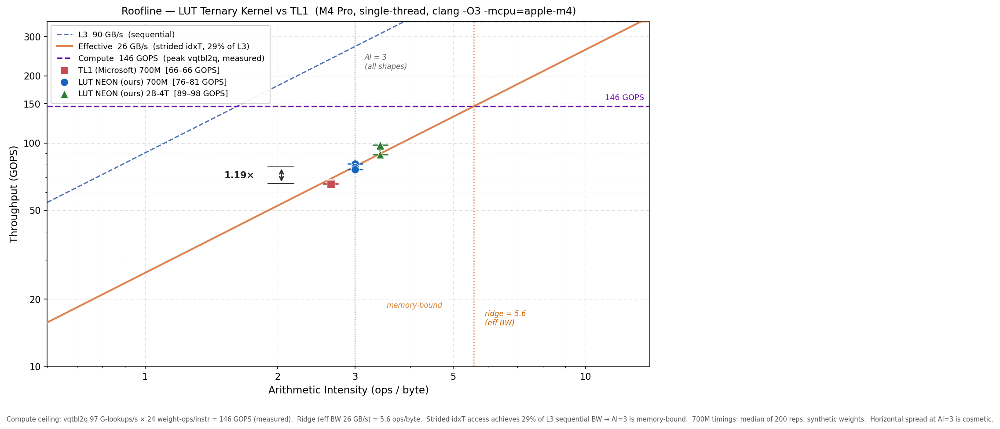

BitNet models store weights as ternary values — just −1, 0, or +1. That should make inference cheap, since multiplication collapses into addition. The question I wanted to answer was whether that theoretical advantage actually survives contact with a real CPU, and if so, what implementation wins.

## What I built

Two kernels for ternary matrix-vector multiply, plus the benchmark harness to compare them fairly against Microsoft's TL1 from `microsoft/BitNet`.

The **add/sub kernel** does the obvious thing: unpack the bit planes, conditionally negate activations, horizontal add. About 1.4 NEON ops per weight. It's the design that would win on custom silicon, where a mux is nearly free.

The **LUT kernel** is the one that actually wins on CPU. Three ternary weights have only 27 possible combinations, so each triple indexes a small table holding the precomputed dot product. A single `vqtbl2q` instruction resolves 16 output rows at once — 24 weight-ops per instruction. Weight indices are precomputed offline, so the hot path is table build plus lookups and nothing else.

## Results

Measured on M4 Pro, single-threaded, against all three real projection shapes from `bitnet_b1_58-large`:

| Shape | LUT (mine) | TL1 | Speedup |
|---|---|---|---|
| 4096×1536 (gate/up) | 77 µs | 96 µs | 1.24× |
| 1536×4096 (down) | 83 µs | 98 µs | 1.18× |
| 1536×1536 (attn) | 30 µs | 36 µs | 1.18× |

Output is verified bit-exact against TL1 before any timing is taken — zero mismatches across all-+1, all-−1, all-zero, and random weight cases.

## Finding the real bottleneck

The roofline analysis is the part I'd point an interviewer at. Arithmetic intensity works out to exactly 3.0 ops/byte for every shape — a structural property of the encoding, not a coincidence of dimensions. Against the L3 sequential ridge that reads as compute-bound; against the kernel's *actual* effective bandwidth (~26 GB/s) it's memory-bound.

The gap is the index array's layout. Indices are stored transposed, so consecutive groups sit 64 cache lines apart and each fetched line delivers only about 16 useful bytes — roughly 25% cache-line utilization.

I tested that diagnosis two ways, and both were negative results that confirmed it. Doubling the output tile to BM=64 halved the table loads and bought 1–4%. Packing tables as int8 halved table volume and made things *slower* in the typical case. Neither touches the index stride, and neither helped — which is the evidence that stride, not volume or compute, is what binds.

## Honest scope

The speedup is specific to this chip and these shapes. It is not a general argument that ternary wins — on GPUs, cheap multipliers erase the advantage entirely, and that row of my comparison table is reasoning from first principles rather than measurement. The kernel is single-threaded. The 2B-4T model has no TL1 baseline because `bitnet.cpp` won't build for it on this machine.

The next step I'd take is repacking the index array so tile-local indices are contiguous, which should move effective bandwidth from ~26 GB/s toward the ~90 GB/s sequential rate. Diagnosed, not implemented.
